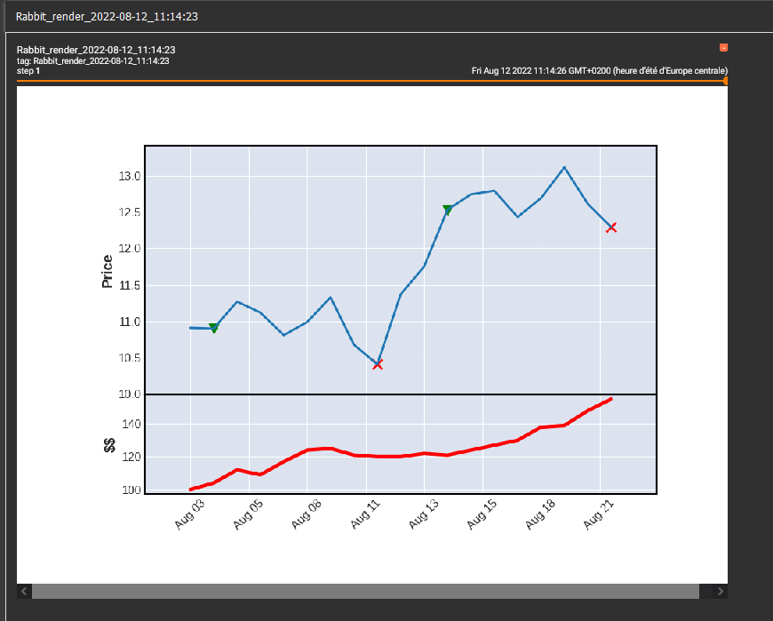

Render financial data
=====================

For now there is only one renderer, the **TensorboardDataRenderer**. It helps you to render financial data and results of machine learning training to Tensorboard.

TensorboardDataRenderer
~~~~~~~~~~~~~~~~~~~~~~~

.. autoclass:: Hmile.DataRenderer.TensorboardDataRenderer
   :members:

**Example: **

.. code-block:: python3

    from datetime import datetime
    import pandas as pd
    from Hmile.DataRenderer import TensorboardDataRenderer
    from Hmile.DataProvider import CSVDataProvider
    from Hmile.FillPolicy import FillPolicyAkima
    PAIR = "BTCUSD"
    START = "2021-12-01"
    END = "2022-12-31"
    DATA_DIR = "/my/data/dir"
    INTERVAL = "hour"

    def fill_renderer(data, renderer):
    # we fill the renderer with data rows
    for index, row in data.iterrows():
        renderer.append("open", row["open"], index)
        renderer.append("close", row["close"], index)
        renderer.append("high", row["high"], index)
        renderer.append("low", row["low"], index)
        renderer.append("volume", row["volume"], index)

    # we create a renderer object
    renderer = TensorboardDataRenderer('logs/')
    # we create a data provider object
    dp = CSVDataProvider(PAIR, START, END, DATA_DIR, interval=INTERVAL)
    # we set a fill policy
    dp.fill_policy = FillPolicyAkima(INTERVAL)
    # we read data
    data = dp.getData()
    # we fill renderer
    fill_renderer(data, renderer)
    # we launch renderer
    renderer.render() 
    # then we increment tensorboard step
    renderer.next_step()
    # we refill the renderer
    fill_renderer(data, renderer)
    # we launch renderer
    renderer.render()

Exemple result in tensorboard :

**Remark :**

In the upper example we only used financial data. However you can add model training info.

.. list-table:: printables informations
   :widths: 25 25 75 
   :header-rows: 1
   
   * - info name
     - required
     - description
   * - open
     - yes
     - open price
   * - high
     - yes
     - high price
   * - close
     - yes
     - close price
   * - volume
     - yes
     - volume price
   * - money
     - no
     - actual possessed money
   * - rew
     - no
     - actual training reward
   * - short
     - no 
     - did the model returns a short signal signal ?
   * - long
     - no 
     - did the model returns a long signal signal ?
   * - exit
     - no 
     - did the model returns a exit signal signal ?

So you could add any information you want by adding a new key to the renderer in the fill_renderer loop. As :

.. code-block:: python3
    
    renderer.append("rew", random.random()*1000, index)
    renderer.append("long", random.choose([1, None]), index)