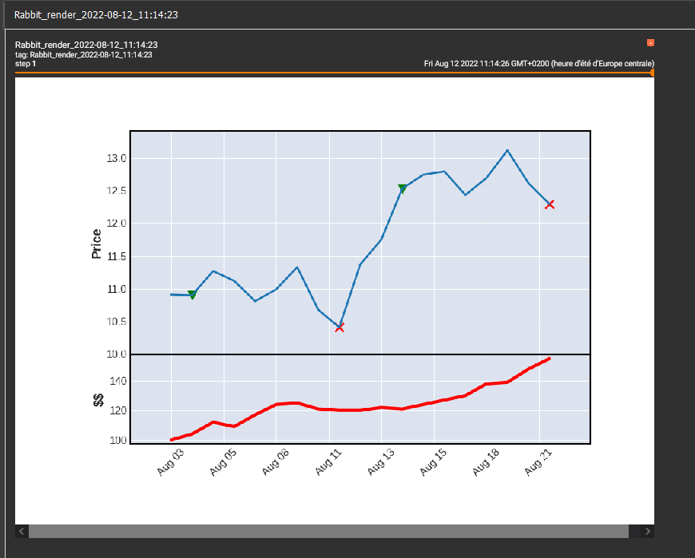

.. 8mile-render documentation master file, created by
   sphinx-quickstart on Fri Aug 12 08:58:15 2022.
   You can adapt this file completely to your liking, but it should at least
   contain the root `toctree` directive.

Welcome to 8mile-render's documentation!
========================================

.. toctree::
   :maxdepth: 2
   :caption: Contents:

8mile allow users to renderer time series data and especially financial ones.

1. Installation
---------------

.. code-block:: bash
   :caption: EXT:installation
   
   pip3 install git+https://github.com/theophane-droid/8miles-render

2. Examples 
-----------

2.1 Import data from yahoo finance :
~~~~~~~~~~~~~~~~~~~~~~~~~~~~~~~~~~~~

.. code-block:: python3
   :caption: EXT:import_data
   
   PAIR = "BTCUSD"
   START = "2022-01-01"
   END = "2022-01-03"
   INTERVAL = "hour"

   dp = YahooDataProvider(PAIR, START, END, interval=INTERVAL)
   # used to fill eventual missing dates (optionnal)
   dp.fill_policy = FillPolicyAkima(INTERVAL)

   data = dp.getData()

2.2 Download data from elasticsearch and add all ta features
~~~~~~~~~~~~~~~~~~~~~~~~~~~~~~~~~~~~~~~~~~~~~~~~~~~~~~~~~~~~

.. code-block:: python3
   :caption: EXT:download_data

   PAIR = "BTCUSD"
   START = "2022-01-01"
   END = "2022-01-03"
   INTERVAL = "hour"
   ES_URL = "http://localhost:9200"
   ES_USER = "elastic"
   ES_PASS = "changeme"

   dp = ElasticDataProvider(PAIR, START, END, ES_URL, ES_USER, ES_PASS, interval=INTERVAL)
   data = TaFeaturesTransformer(dp).transform()

2.3 Use a RabbitRenderer to print time series in tensorboard
~~~~~~~~~~~~~~~~~~~~~~~~~~~~~~~~~~~~~~~~~~~~~~~~~~~~~~~~~~~~

.. code-block:: python3
   :caption: EXT:rabbit_renderer.py

   from datetime import datetime
   import pandas as pd
   from Hmiler.RabbitRenderer import RabbitRenderer

   def fill_renderer(data, renderer):
    # we fill the renderer with data rows
      for index, row in data.iterrows():
         date = datetime.strptime(row["Date"], "%Y-%m-%d")
         renderer.append("open", row["open"], date)
         renderer.append("close", row["close"], date)
         renderer.append("high", row["high"], date)
         renderer.append("low", row["low"], date)
         renderer.append("volume", row["volume"], date)
         renderer.append("exit", row["exit"], date)
         renderer.append("long", row["long"], date)
         renderer.append("short", row["short"], date)
         renderer.append("money", row["money"], date)

   # we create a renderer object
   renderer = RabbitRenderer('logs/')
   # we read data
   data = pd.read_csv('data/data.csv')
   # we fill renderer
   fill_renderer(data, renderer)
   # we launch renderer
   renderer.render() 
   # then we increment tensorboard step
   renderer.next_step()
   # we refill the renderer
   fill_renderer(data, renderer)
   # we launch renderer
   renderer.render()

Result in tensorboard :

   

3. Core classes
---------------

3.1 Dataprovider
~~~~~~~~~~~~~~~~

Theses classes are used to get data from an external source.

.. autoclass:: Hmile.DataProvider.YahooDataProvider
   :members:
   :inherited-members:

.. autoclass:: Hmile.DataProvider.CSVDataProvider
   :members:
   :inherited-members:

.. autoclass:: Hmile.DataProvider.ElasticDataProvider
   :members:
   :inherited-members:

.. autoclass:: Hmile.DataProvider.PolygonDataProvider
   :members:
   :inherited-members:

3.2 Dataexporter
~~~~~~~~~~~~~~~~

Theses classes are used to export data to a specific format.

.. autoclass:: Hmile.DataExporter.CSVDataExporter
   :members:
   :inherited-members:

.. autoclass:: Hmile.DataExporter.ElasticDataExporter
   :members:
   :inherited-members:

3.3 DataTransformer
~~~~~~~~~~~~~~~~~~~	

Theses classes are used to apply diverses transformations on data.

.. autoclass:: Hmile.DataTransformer.TaFeaturesTransformer
   :members:
   :inherited-members:

3.4 Renderer
~~~~~~~~~~~~

Theses classes are used to render data in tensorboard.

.. autoclass:: Hmile.RabbitRenderer.RabbitRenderer
   :members:
   :inherited-members:

3.5 FillPolicy
~~~~~~~~~~~~~~

Theses classes are used to fill dataframe when dates are missing in data.

.. autoclass:: Hmile.FillPolicy.FillPolicyError
   :members:
   :inherited-members:

.. autoclass:: Hmile.FillPolicy.FillPolicyClip
   :members:
   :inherited-members:

.. autoclass:: Hmile.FillPolicy.FillPolicyAkima
   :members:
   :inherited-members:

3.6 ModelStore
~~~~~~~~~~~~~~

.. autoclass:: Hmile.ModelStore.MetaModel
   :members:
   :inherited-members:

.. autoclass:: Hmile.ModelStore.MetaModelStore
   :members:
   :inherited-members:

.. autoclass:: Hmile.ModelStore.ElasticMetaModelStore
   :members:
   :inherited-members:

.. autoclass:: Hmile.ModelStore.ModelStore
   :members:
   :inherited-members:

.. autoclass:: Hmile.ModelStore.LocalModelStore
   :members:
   :inherited-members:

3.7 Utils
~~~~~~~~~

.. autoclass:: Hmile.utils.DataTensorer
   :members:
   :inherited-members:

Exceptions
----------
.. autoclass:: Hmile.Exception.ColumnNameDoesNotExists
   :members:
   :inherited-members:

.. autoclass:: Hmile.Exception.DataframeFormatException
   :members:
   :inherited-members:

.. autoclass:: Hmile.Exception.DataProviderArgumentException
   :members:
   :inherited-members:

.. autoclass:: Hmile.Exception.NoFillPolicySet
   :members:
   :inherited-members:

Indices and tables
==================

* :ref:`genindex`
* :ref:`modindex`
* :ref:`search`
